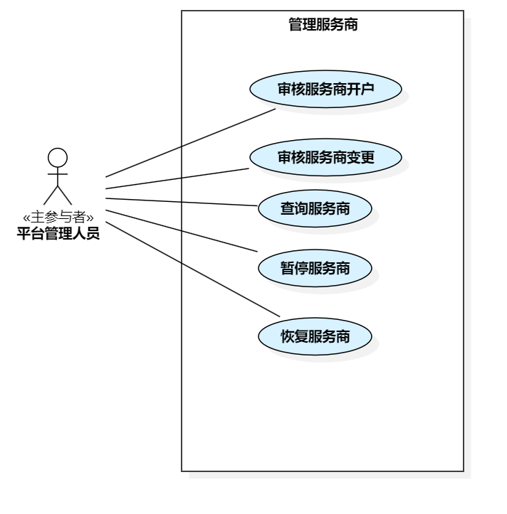

== 3.4 平台管理人员

image::平台管理人员用例总图.png[]

=== 3.4.1 管理商户

include::shop-mgt/MALL-SHOP-008-ReviewMerchantAccountOpening.adoc[]
include::shop-mgt/MALL-SHOP-009-ReviewMerchantChange.adoc[]
include::shop-mgt/MALL-SHOP-011-SuspendMerchant.adoc[]
include::shop-mgt/MALL-SHOP-012-RestoreMerchant.adoc[]

=== 3.4.2 管理商品

image::管理商品.png[]

include::product-mgt/MALL-PRODUCT-012-ReviewNewProduct.adoc[]
include::product-mgt/MALL-PRODUCT-013-ReviewChangedProduct.adoc[]
include::product-mgt/MALL-PRODUCT-014-EstablishProductCategories.adoc[]
include::product-mgt/MALL-PRODUCT-015-DeleteProductCategory.adoc[]
include::product-mgt/MALL-PRODUCT-016-ModifyProductCategory.adoc[]
include::product-mgt/MALL-PRODUCT-017-QueryProduct.adoc[]

=== 3.4.3 管理活动

image::管理活动.png[]

include::activity-mgt/MALL-PRODUCT-018-ReviewActivity.adoc[]
include::activity-mgt/MALL-PRODUCT-019-QueryActivity.adoc[]

=== 3.4.4 管理顾客

include::customer-mgt/MALL-CUST-013-BanCustomer.adoc[]
include::customer-mgt/MALL-CUST-023-UnbanCustomer.adoc[]
include::customer-mgt/MALL-CUST-014-QueryCustomer.adoc[]
include::customer-mgt/MALL-CUST-015-DeregisterCustomer.adoc[]

=== 3.4.5 管理服务商

宋浩元
include::service-mgt/MALL-SERVICE-022-ReviewServiceProvider.adoc[]