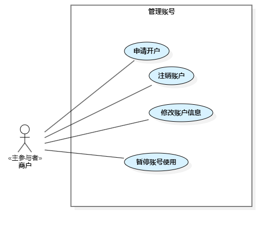

== 3.3 商户

]

=== 3.3.1 管理商品
image::商户-管理商品.png[]

include::product-mgt/MALL-PRODUCT-004-ApplyNewProduct.adoc[]
include::product-mgt/MALL-PRODUCT-005-ApplyProductChange.adoc[]
include::product-mgt/MALL-PRODUCT-006-QueryProduct.adoc[]
include::product-mgt/MALL-PRODUCT-007-ModifyProductAttributes.adoc[]

=== 3.3.2 管理销售
image::商户-管理销售.png[]

include::sale-mgt/MALL-PRODUCT-008-ListProduct.adoc[]
include::sale-mgt/MALL-PRODUCT-009-DelistProduct.adoc[]
include::sale-mgt/MALL-PRODUCT-010-QuerySales.adoc[]
include::sale-mgt/MALL-PRODUCT-011-DeleteProductSale.adoc[]

=== 3.3.3 管理活动

image::商户-管理活动.png[]

include::activity-mgt/MALL-ACTIVITY-020-AddPromotionalActivity.adoc[]
include::activity-mgt/MALL-ACTIVITY-021-CancelActivity.adoc[]
include::activity-mgt/MALL-ACTIVITY-022-QueryActivity.adoc[]
include::activity-mgt/MALL-ACTIVITY-024-SpecifySalesParticipating.adoc[]
include::activity-mgt/MALL-ACTIVITY-025-AddGroupBuyActivity.adoc[]

=== 3.3.4 管理订单
image::商户-管理订单.png[]

include::order-mgt/MALL-ORDER-003-AcceptOrder.adoc[]
include::order-mgt/MALL-ORDER-004-QueryOrder.adoc[]
include::order-mgt/MALL-ORDER-005-CancelOrder.adoc[]
include::order-mgt/MALL-ORDER-006-ShipOrder.adoc[]

=== 3.3.5 管理账号

include::account-mgt/MALL-SHOP-001-AccountOpening.adoc[]
include::account-mgt/MALL-SHOP-002-AccountCancellation.adoc[]
include::account-mgt/MALL-SHOP-003-ModifyAccount.adoc[]
include::account-mgt/MALL-SHOP-004-ModifyAccountAttributes.adoc[]

=== 3.3.6 管理人员

include::staff-mgt/MALL-SHOP-005-AddStaffAccount.adoc[]
include::staff-mgt/MALL-SHOP-006-DeleteStaffAccount.adoc[]
罗芳魁
include::staff-mgt/MALL-SHOP-011-ResumeStaffAccount.adoc[]

=== 3.3.7 管理服务

=== 3.3.8 管理服务商

=== 3.3.9 管理支付

