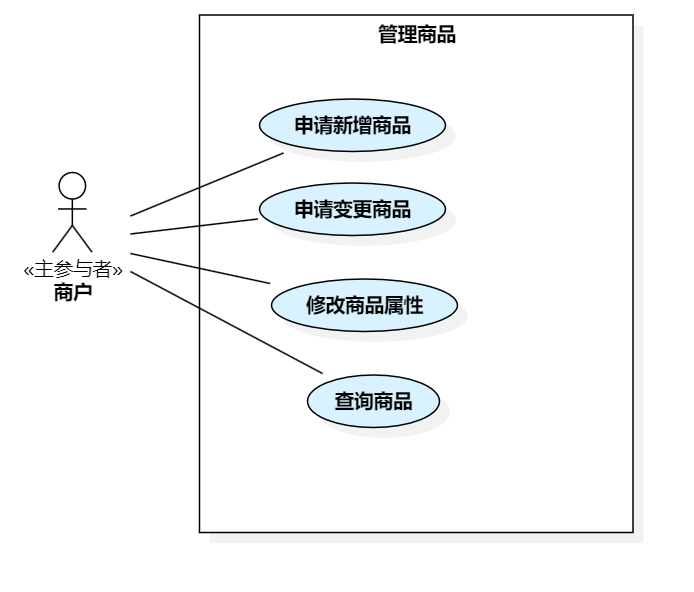
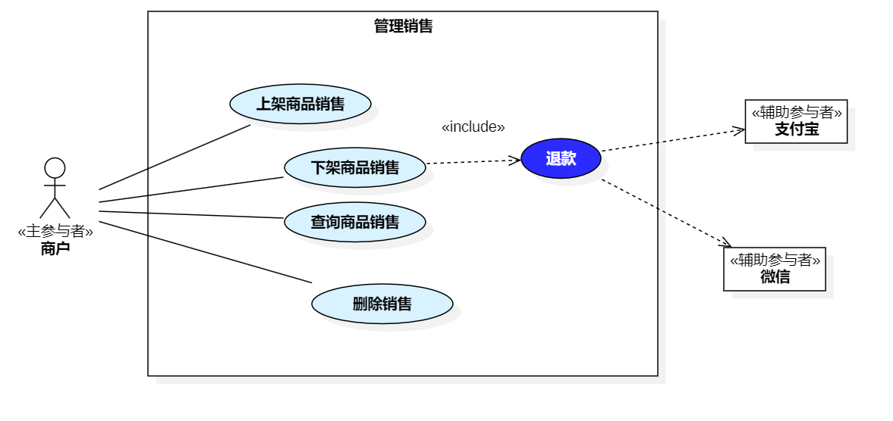

== 3.3 商户

]

=== 3.3.1 管理商品

include::MALL-PRODUCT-004-ApplyNewProduct.adoc[]
include::MALL-PRODUCT-005-ApplyProductChange.adoc[]
include::MALL-PRODUCT-006-QueryProduct.adoc[]
include::MALL-PRODUCT-007-ModifyProductAttributes.adoc[]

=== 3.3.2 管理销售

include::MALL-PRODUCT-008-ListProduct.adoc[]
include::MALL-PRODUCT-009-DelistProduct.adoc[]
include::MALL-PRODUCT-010-QuerySales.adoc[]
include::MALL-PRODUCT-011-DeleteProductSale.adoc[]

=== 3.3.3 管理活动

include::MALL-ACTIVITY-020-AddPromotionalActivity.adoc[]
include::MALL-ACTIVITY-021-CancelActivity.adoc[]
include::MALL-ACTIVITY-022-QueryActivity.adoc[]
include::MALL-ACTIVITY-024-SpecifySalesParticipating.adoc[]
include::MALL-ACTIVITY-025-AddGroupBuyActivity.adoc[]

=== 3.3.4 管理订单
image::商户-管理订单.png[]

include::MALL-ORDER-003-AcceptOrder.adoc[]
include::MALL-ORDER-004-QueryOrder.adoc[]
include::MALL-ORDER-005-CancelOrder.adoc[]
include::MALL-ORDER-006-ShipOrder.adoc[]
